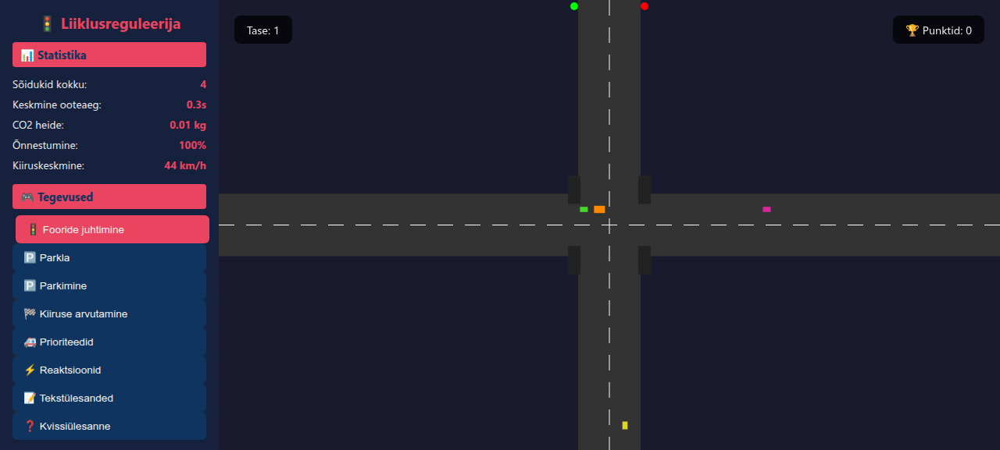

# 🚦 Traffic Game — Interactive Educational Game

**Interactive educational game** for learning traffic planning, parking, and reaction skills. Fully self-contained, zero dependencies.

[](https://opensource.org/licenses/MIT)
[](https://developer.mozilla.org/en-US/docs/Web/HTML)

[](https://stennu718.github.io/traffic-game/)



**Live:** [https://stennu718.github.io/traffic-game/](https://stennu718.github.io/traffic-game/)

---

## 🎮 Game Activities (8)

| # | Activity | Controls | Educational Aspect |
|---|----------|----------|-------------------|
| 1 | 🚦 **Traffic Light Control** | Click light | Light cycles, wait time, priorities |
| 2 | 🅿️ **Parking Lot** | Click spot | Lot structure, occupancy, selection |
| 3 | 🅿️ **Parking** | ← → ↑ Q/E | Parallel parking, maneuvering |
| 4 | 🏁 **Speed Calculation** | Multiple choice | Stopping distances, CO2, reaction |
| 5 | 🚑 **Priorities** | Override lights | Ambulance, bus, tram priorities |
| 6 | ⚡ **Reactions** | Click on green | Reaction time (~1.5s norm) |
| 7 | 📝 **Text Tasks** | Enter number | Fuel cost, parking fee, driving distance |
| 8 | ❓ **Quiz** | Multiple choice | Traffic rules, Estonian law |

---

## 📝 Text Tasks (17 total)

Each task includes calculation steps and hints. Answers checked with tolerance.

| Category | Tasks |
|----------|-------|
| 🅿️ Parking | Parking fee (Tallinn), parking meter, lot revenue, occupancy, parallel parking, finding spot |
| ⛽ Fuel/Energy | Fuel consumption, EV charging, cost per km, acceleration |
| 🚗 Traffic | Speed and time, driving distance, braking distance signs, traffic flow density |
| 🛞 Maintenance | Tire pressure |
| 🚦 Lights | Traffic light wait time (probability) |

---

## 🅿️ Parking Lot Game

- 4×6 parking spots, ~40% randomly occupied
- ⭐ starred spot is the target
- Click correct → +50 points, new arrangement after 1.5s
- Feedback on wrong spot (occupied/available)

## 🅿️ Parking Simulator

- **Keyboard**: ← → steer, ↑ drive forward, ↓ reverse, Q/E fine steering
- Drive the car into the green parking spot
- +100 points for successful maneuver
- New position after successful parking

---

## 📊 Statistics Tracked

| Metric | Description |
|--------|-------------|
| Vehicles total | Number of vehicles passed |
| Average wait time | Time spent waiting at lights |
| CO2 emissions | Idling engine emissions (kg) |
| Success rate | Vehicles with <3s wait (%) |
| Average speed | Real traffic flow (km/h) |

---

## 🎯 Events

Random events occur every **15-25 seconds** (auto mode paused during events):

- 🚑 Ambulance arriving — yield
- ⚠️ Accident on road — slow down traffic
- 🚌 Bus priority — give right of way
- 🌧️ Rain — extend red light
- 🏎️ Speed limit — check your speed

---

## 🚀 Running

```bash
# Simple — open in browser
open index.html

# Or Python server
python3 -m http.server 8080
# Open: http://localhost:8080
```

---

## 🧠 Learning Objectives

- Understand traffic light operation and wait times
- Calculate stopping distances at different speeds
- Know the relationship between CO2, speed, and waiting
- Handle priorities (ambulance, bus, tram)
- Develop reaction time
- Calculate parking fees and fuel costs
- Understand traffic planning principles

---

## ⚠️ Known Issues

| # | Issue | Priority | Solution |
|---|-------|----------|----------|
| 1 | **Parking sim**: Missing full collision detection | Medium | Add detection for sufficient parallelism with box |
| 2 | **Parking**: Target spot may be unreachable (surrounded) | Medium | Algorithm to guarantee path to target |
| 3 | **Light clicking**: Click area may be small on large screens | Low | Increase click radius |
| 4 | **Text tasks**: Enter key not auto-submitted | Low | Add keypress Enter handler |
| 5 | **Reaction test**: No time limit — can wait forever | Low | Add 5s timeout |
| 6 | **Events**: New event won't appear until current ends | Low | Queue system for events |
| 7 | **Mobile support**: Clicking works, no touch system | Medium | Touch event listeners |
| 8 | **Sound effects**: Missing | Low | Web Audio API sounds |
| 9 | **Saving**: Points lost on page close | Medium | localStorage |
| 10 | **Difficulty**: Text task difficulty doesn't scale with level | Low | Difficulty = level × multiplier |
| 11 | **Parking lot**: No statistics shown (correct/wrong clicks) | Low | Add counter |
| 12 | **Lights**: Yellow lasts 3s but no countdown shown | Low | Yellow timer |

---

## 🗺️ Roadmap

### Phase 1 — Stability
- [ ] Enter key for text task answers
- [ ] Reaction timeout (5s)
- [ ] localStorage point saving
- [ ] Mobile touch support

### Phase 2 — Content Expansion
- [ ] **Intersection control** — multiple lights at once, coordination
- [ ] **Speed limits** — different types (school zone, street, highway)
- [ ] **Vehicles** — different types (truck, motorcycle, bus) with different properties
- [ ] **Weather** — rain/snow/mountains effect on braking distance
- [ ] **Night mode** — driving in the dark, headlight usage
- [ ] **Special parking types** — perpendicular, parallel, reverse

### Phase 3 — Deepening
- [ ] **Session tracking** — multiplayer mode
- [ ] **Leaderboard** — best results
- [ ] **Sequential tasks** — "task of the day", new one each day
- [ ] **Probability tasks** — calculations based on statistics
- [ ] **3D view** — Three.js based 3D intersection

### Phase 4 — Platform
- [ ] **Android/iOS** — PWA or React Native
- [ ] **Offline support** — Service Worker
- [ ] **Multilingual** — English, Finnish, Russian
- [ ] **API** — result sharing (voluntary)

---

## 📄 License

**MIT** — Free for educational use.

## 👨‍💻 Author

**Sten** — Estonia, interested in traffic and educational content.
